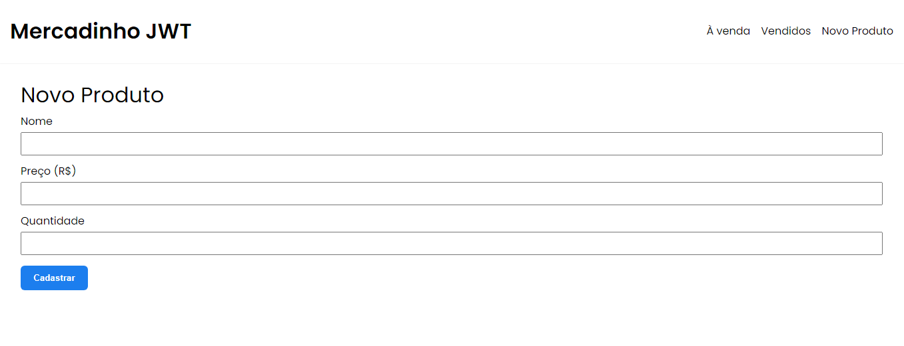
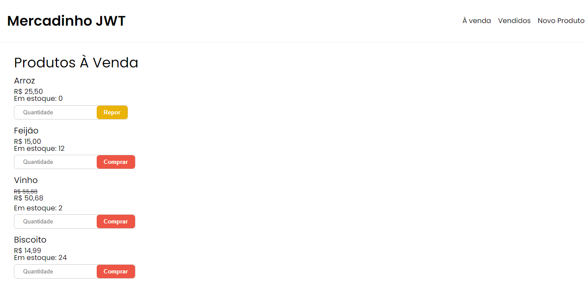
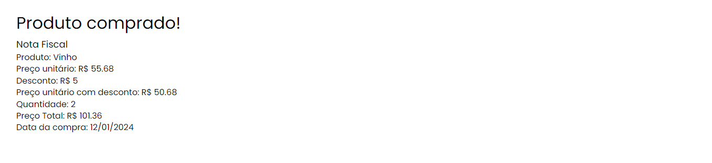
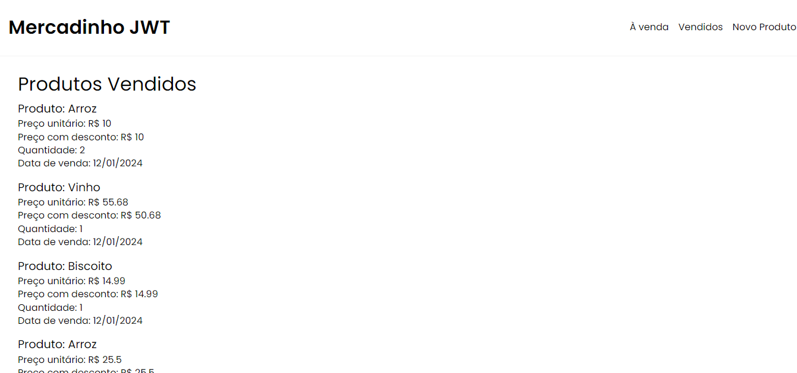

# Mercadinho JWT

## Introdução

Mercadinho JWT é um sistema desenvolvido em php com o intuito de simular um ponto de venda (pdv). O sistema foi desenvolvido em resposta ao Desafio técnico: Desenvolvedor de Software
da empresa "Objetivo Sistemas".

## Descrição

O sistema foi criado com php e construido a partir do padrão MVC (Model, View, Controller). As telas foram construídas utilizando html e css, enquanto as interações são realizadas
e dados são modificados a partir de arquivos .csv, simulando um banco de dados relacional.

## Recursos
É permitido:
  - Lançar venda de produtos <br>
  - Comprar produtos <br>
  - Repor produtos <br>
  - Verificar log dos produtos vendidos <br>

## Softwares Utilizados
- Visual Studio Code
- XAMPP

## Requisitos

- PHP 7.6 ou superior
- Composer 2.6.5 ou superior

## Execução

```
# Clone este repositório
$ git clone https://github.com/GKeslley/mercadinho-jwt.git

# Acesse a pasta do projeto no seu terminal/cmd e insira dentro da pasta "htdocs" do seu apache
$ cd mercadinho_jwt

#Inicie o servidor local apache

```
## Telas

<h1 align="center">
  
</h1>

<h1 align="center">
  
</h1>

<h1 align="center">
  
</h1>

<h1 align="center">
  
</h1>


